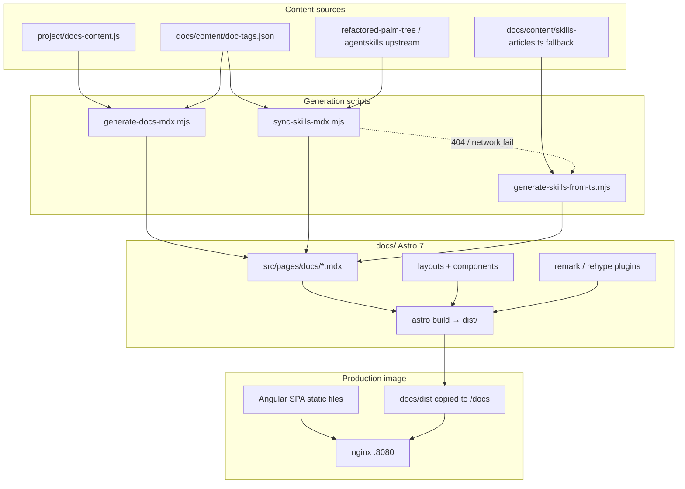

# Interop documentation site — developer guide

This document explains how the **Astro docs site** (`docs/`) works, how it integrates with the Angular registry app, and what to do when you need to change content, layout, or deployment.

For a short quick-start, see [`docs/README.md`](docs/README.md).

---

## What this is

Registry documentation used to live inside the Angular SPA (`frontend/src/app/features/docs/`). That was replaced by a **standalone Astro 7 static site** built from Markdown/MDX and served at **`/docs/*`** alongside the Angular app on the same origin.

| Environment | Docs URL | Registry app URL |
|-------------|----------|------------------|
| Astro dev (`npm run dev` in `docs/`) | `http://localhost:4321/docs/overview` | `http://localhost:4200` (header links point here) |
| Full stack (`docker compose up`) | `http://localhost:4200/docs/overview` | same host — relative links |
| Production | `https://<host>/docs/overview` | same host |

The Angular app no longer has `/docs` routes. The header **Docs** link and app switcher go to `/docs/overview` via a normal navigation (full page load for `/docs/*`).

---

## Architecture



### Request routing (production nginx)

`frontend/nginx.conf` serves paths in this order:

1. **`/api/*`** → backend (Express)
2. **`/docs/*`** → static Astro HTML (`try_files $uri $uri/ $uri/index.html`)
3. **`/_astro/*`** → Astro hashed JS/CSS (immutable cache)
4. **`/fonts/*`** → Geist fonts used by docs
5. **Everything else** → Angular `index.html` (SPA fallback)

The Docker image is built in three stages (`frontend/Dockerfile`):

1. **angular-builder** — `npm run build` in `frontend/`
2. **docs-builder** — Node 22, `npm run content:sync && npm run build` in `docs/`
3. **runner** — nginx with Angular `dist/` at web root + `docs/dist/docs` → `/usr/share/nginx/html/docs`

Build context is the **repo root** (not `frontend/`), so the Dockerfile can copy `project/docs-content.js`, `project/styles.css`, and the whole `docs/` tree.

---

## Repository layout (`docs/`)

```
docs/
├── astro.config.mjs          # Astro 7 config, MDX unified processor, /api dev proxy
├── package.json
├── .env.development          # PUBLIC_APP_ORIGIN for header links in dev
├── .env.example
├── content/
│   ├── doc-tags.json         # tags per article id (source of truth for tags: frontmatter)
│   └── skills-articles.ts    # fallback body HTML for skills pages
├── scripts/
│   ├── sync-interop-styles.mjs
│   ├── generate-docs-mdx.mjs
│   ├── sync-skills-mdx.mjs
│   └── generate-skills-from-ts.mjs
├── public/
│   └── fonts/                # Geist font files
└── src/
    ├── components/
    │   ├── SiteHeader.astro  # Registry chrome (nav, search, notifications, app switcher)
    │   ├── PageFeedback.astro
    │   ├── TagList.astro, DocList.astro, DocPager.astro, …
    │   └── mdx/              # Shortcodes: Lead, Callout, DocCards, Steps, …
    ├── layouts/
    │   ├── BaseLayout.astro
    │   ├── DocLayout.astro   # 3-pane article shell
    │   └── TagsLayout.astro
    ├── lib/
    │   ├── nav.ts            # Sidebar order + prev/next (must match content)
    │   ├── docs.ts           # Tag index, related articles
    │   ├── tag-utils.ts
    │   ├── app-url.ts        # Header links to Angular app in dev vs prod
    │   ├── site-header.client.ts
    │   └── remark-*.mjs, rehype-*.mjs
    ├── pages/docs/
    │   ├── *.mdx             # 21 articles (mostly generated — see below)
    │   └── tags/             # /docs/tags, /docs/tags/[tag]
    └── styles/
        ├── docs.css          # imports interop + overrides
        ├── interop.css       # vendored from project/styles.css (do not edit by hand)
        └── docs-overrides.css
```

---

## Content model

There are **21 documentation articles**, in two pipelines:

### 1. Registry articles (13 pages)

| Source | `project/docs-content.js` |
| Output | `docs/src/pages/docs/<id>.mdx` |
| Generator | `npm run generate-docs` |

Content is defined as structured blocks (`lead`, `h2`, `callout`, `steps`, `cards`, `table`, …) in `window.DOCS.ARTICLES`. The generator converts them to MDX with shortcode imports.

**Nav order** comes from `window.DOCS.NAV` in the same file. **`docs/src/lib/nav.ts`** mirrors that structure for the sidebar and prev/next pager — if you add or reorder pages, update **both** `project/docs-content.js` and `nav.ts`.

### 2. Agent Skills articles (8 pages)

| Primary source | Upstream markdown in [refactored-palm-tree](https://github.com/adamstavely/refactored-palm-tree) (`skills/*.md`) |
| Fallback | `docs/content/skills-articles.ts` |
| Generator | `npm run sync-skills` (tries upstream, then fallback) |
| Output | `docs/src/pages/docs/skills-*.mdx` |

Upstream MDX-ish components (`<CardGroup>`, etc.) are converted to our shortcodes or `RawHtml` where needed.

### Tags

| Source | `docs/content/doc-tags.json` |
| Applied by | generators inject `tags:` into frontmatter |

Tags drive:

- Chips under the article title
- `/docs/tags` index
- `/docs/tags/<slug>` filtered lists
- “Related” section at the bottom of articles

Slug rules live in `src/lib/tag-utils.ts` (`slugifyTag`).

### Generated vs hand-edited MDX

**Treat `src/pages/docs/*.mdx` as generated output** unless you have a deliberate reason to own a file by hand. After changing sources, run:

```bash
cd docs
npm run content:sync
```

Then commit both the source change and the regenerated `.mdx` files.

**Important:** Astro page MDX does **not** auto-register global components. Generated files include explicit imports:

```mdx
import Callout from '../../components/mdx/Callout.astro';
import Lead from '../../components/mdx/Lead.astro';
…
```

If you hand-write an MDX page, copy that import pattern from a generated file.

---

## How to update content

### Edit an existing registry article

1. Edit the article in `project/docs-content.js` (`ARTICLES.<id>.blocks`, title, desc).
2. If tags change, edit `docs/content/doc-tags.json`.
3. Regenerate:
   ```bash
   cd docs && npm run generate-docs
   ```
4. Preview: `npm run dev` → `http://localhost:4321/docs/<id>`
5. Commit `project/docs-content.js`, `doc-tags.json`, and the updated `.mdx`.

### Refresh Agent Skills articles from upstream

```bash
cd docs
npm run sync-skills
```

If upstream fetch fails (404, offline), the script falls back to `generate-skills-from-ts.mjs` using `docs/content/skills-articles.ts`. To force fallback-only:

```bash
node docs/scripts/generate-skills-from-ts.mjs
```

### Add a new documentation page

1. **Registry article**
   - Add entry to `NAV` + `ARTICLES` in `project/docs-content.js`.
   - Add tags in `docs/content/doc-tags.json`.
   - Add matching item to `docs/src/lib/nav.ts` (correct group + order).
   - Run `npm run generate-docs`.

2. **Skills article**
   - Add to upstream repo (preferred) or `skills-articles.ts`.
   - Add mapping in `sync-skills-mdx.mjs` `ARTICLES` array.
   - Add to `nav.ts` under “Agent Skills”.
   - Add tags in `doc-tags.json`.
   - Run `npm run sync-skills`.

3. **Fully custom MDX page** (rare)
   - Create `src/pages/docs/my-page.mdx` with `layout: ../../layouts/DocLayout.astro` frontmatter.
   - Import any MDX shortcodes you use.
   - Add to `nav.ts` and `doc-tags.json`.
   - Do **not** run `generate-docs` for that id or it will be overwritten (remove from `ARTICLES` or adjust the generator).

4. Verify build: `npm run build && npm run check`.

### Change sidebar labels or order

Edit **`docs/src/lib/nav.ts`** (`DOC_NAV`). For registry pages, keep in sync with `project/docs-content.js` `NAV`.

### Change styling

| What | Where |
|------|--------|
| Design tokens, header, buttons, base `.docs-*` | `project/styles.css` (canonical) |
| Vendored copy for docs | `docs/src/styles/interop.css` — run `npm run sync-styles` |
| Docs-only tweaks (prose, footer, tags, feedback) | `docs/src/styles/docs-overrides.css` |
| Vendored copy for Angular | `frontend/src/vendor/interop.css` |

CI job **`styles-sync`** fails if `project/styles.css` ≠ vendored copies. After editing canonical CSS:

```bash
cp project/styles.css frontend/src/vendor/interop.css
node docs/scripts/sync-interop-styles.mjs
# or: npm run sync-styles  (from docs/)
```

`npm run build` in `docs/` also runs `prebuild` → `sync-interop-styles.mjs` automatically.

---

## Page features

### Reading time & last updated

| Feature | Plugin | Display |
|---------|--------|---------|
| Reading time | `remark-reading-time.mjs` | Clock + “N min read” in meta row |
| Last updated | `remark-last-updated.mjs` | Git last-commit date on file (fallback: mtime) |

Both inject into frontmatter at build time. **Do not** hand-maintain `readTime` / `updatedAt` in sources.

### “On this page” TOC

`DocLayout.astro` builds a right-rail TOC from **H2 headings** in the MDX (minimum 2 H2s to show). Use `##` in markdown or `{ t: 'h2', v: '…' }` blocks in `docs-content.js`.

### Prev / next

Order follows `ALL_DOC_ITEMS` in `nav.ts` (flat list of sidebar order).

### Page feedback

- UI: `PageFeedback.astro` in article footer (“Was this page helpful?”)
- API: `POST /api/docs/feedback`, `GET /api/docs/feedback/session`
- Backend: `backend/src/api/routes/docs-feedback.ts` → Elasticsearch index `interop-docs-feedback`
- Anonymous cookie `interop_docs_visitor` dedupes one vote per page per browser

Astro dev proxies `/api` to `BACKEND_URL` (default `http://localhost:3000`). Start the backend for feedback to work locally.

### Site header on docs pages

`SiteHeader.astro` matches the Angular header: Browse, Collections, Docs, Admin (if signed in), search, Publish, theme toggle, notifications, app switcher, avatar.

Client behavior is in `site-header.client.ts` (auth from `mock-auth` / OIDC tokens, notifications API, theme via `interop-theme` localStorage).

**Dev vs prod links:** In dev, Browse / Collections / Publish point to `PUBLIC_APP_ORIGIN` (`http://localhost:4200` in `.env.development`). In production builds, links are relative (`/`, `/collections`, `/register`) because nginx serves both apps on one host.

---

## Local development

### Docs only

```bash
cd docs
npm install
npm run dev
# → http://localhost:4321/docs/overview
```

Optional: run backend for feedback API:

```bash
cd backend && npm run dev   # :3000
```

Optional: run Angular for header links and cross-app testing:

```bash
cd frontend && npm start    # :4200
```

If Angular is not on 4200, set `PUBLIC_APP_ORIGIN` in `docs/.env.local`.

### Full stack (recommended for integration testing)

```bash
cp .env.example .env
docker compose up -d --build
# → http://localhost:4200/docs/overview
```

### Build & typecheck

```bash
cd docs
npm run content:sync   # refresh MDX from sources (Docker does this too)
npm run build          # → docs/dist/
npm run preview        # serve dist locally
npm run check          # astro check
```

Requires **Node.js 22+** (Astro 7).

---

## CI

| Job | What it checks |
|-----|----------------|
| `docs` | `npm ci`, `npm run build`, `npm run check` in `docs/` (Node 22) |
| `styles-sync` | `project/styles.css` matches vendored `interop.css` in frontend + docs |
| `docker` | Builds `frontend/Dockerfile` from repo root |
| `compose` | Smoke test hits `http://localhost:4200/docs/overview` |

---

## Environment variables (`docs/`)

| Variable | Default | Purpose |
|----------|---------|---------|
| `SITE_URL` | `http://localhost:4321` | Canonical site URL (sitemap, absolute URLs) |
| `BACKEND_URL` | `http://localhost:3000` | Astro dev proxy target for `/api` |
| `PUBLIC_APP_ORIGIN` | `http://localhost:4200` in dev (`.env.development`) | Absolute URLs to Angular app from docs header |

Leave `PUBLIC_APP_ORIGIN` **unset in production builds** so links stay same-origin.

---

## MDX shortcodes

| Component | File | Use |
|-----------|------|-----|
| `Lead` | `mdx/Lead.astro` | Intro paragraph |
| `Callout` | `mdx/Callout.astro` | Note / warning callouts (`tone`, `icon`) |
| `DocCards` | `mdx/DocCards.astro` | Linked card grid |
| `Steps` | `mdx/Steps.astro` | Numbered steps |
| `KeyVal` | `mdx/KeyVal.astro` | Key/value rows |
| `DocTable` | `mdx/DocTable.astro` | Data tables |
| `RawHtml` | `mdx/RawHtml.astro` | Pre-rendered HTML (skills fallback bodies) |

Reference implementation for block types: `docs/scripts/generate-docs-mdx.mjs` → `renderBlock()`.

---

## Common handoff checklist

- [ ] Node 22+ for docs and the Angular 22 frontend; Node 20 for the backend
- [ ] After editing `project/docs-content.js`: `cd docs && npm run generate-docs`
- [ ] After editing skills sources: `npm run sync-skills`
- [ ] After editing `project/styles.css`: sync to `docs/src/styles/interop.css` and `frontend/src/vendor/interop.css`
- [ ] New page: update `nav.ts`, `doc-tags.json`, regenerate MDX, verify `npm run build`
- [ ] Docker rebuild after docs changes: `docker compose up -d --build` (docs are baked into the frontend image)
- [ ] Angular header already links to `/docs/overview` — no SPA route changes needed for docs

---

## Troubleshooting

| Symptom | Likely cause | Fix |
|---------|----------------|-----|
| Browse / Collections / Publish 404 on `:4321` | Docs dev server doesn’t serve Angular routes | Run Angular on `:4200` or set `PUBLIC_APP_ORIGIN` |
| Page feedback errors in dev | Backend not running | Start backend on `:3000` or set `BACKEND_URL` |
| `styles-sync` CI fails | Vendored CSS stale | Sync from `project/styles.css` |
| MDX build error “X is not defined” | Missing component import | Add `import` at top of `.mdx` |
| Skills sync pulls old content | Upstream cache / fallback | Check network; verify `refactored-palm-tree` paths in `sync-skills-mdx.mjs` |
| `/docs/overview` 404 in Docker | Stale image | Rebuild frontend image; confirm `docs-builder` stage ran `content:sync` |
| Sidebar link goes nowhere | `nav.ts` out of sync | Align `nav.ts` with actual MDX filenames |
| Last updated shows wrong date | No git history for file | Commit the `.mdx`; plugin uses `git log -1` on the file path |

---

## Related files outside `docs/`

| Path | Role |
|------|------|
| `project/docs-content.js` | Canonical registry doc content + NAV |
| `project/styles.css` | Canonical design system |
| `frontend/Dockerfile` | Multi-stage build including Astro docs |
| `frontend/nginx.conf` | `/docs`, `/_astro`, `/fonts` routing |
| `frontend/src/app/shared/components/header/` | Angular header (reference for docs header parity) |
| `backend/src/api/routes/docs-feedback.ts` | Feedback API |
| `.github/workflows/ci.yml` | `docs` and `compose` jobs |

---

## Further reading

- [`docs/README.md`](docs/README.md) — short quick-start
- [Astro 7 docs](https://docs.astro.build/)
- [verbose-sniffle](https://github.com/adamstavely/verbose-sniffle) — reference patterns for remark plugins, tags, and feedback (prior art)
